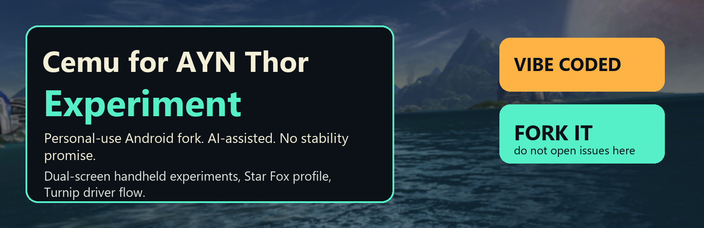
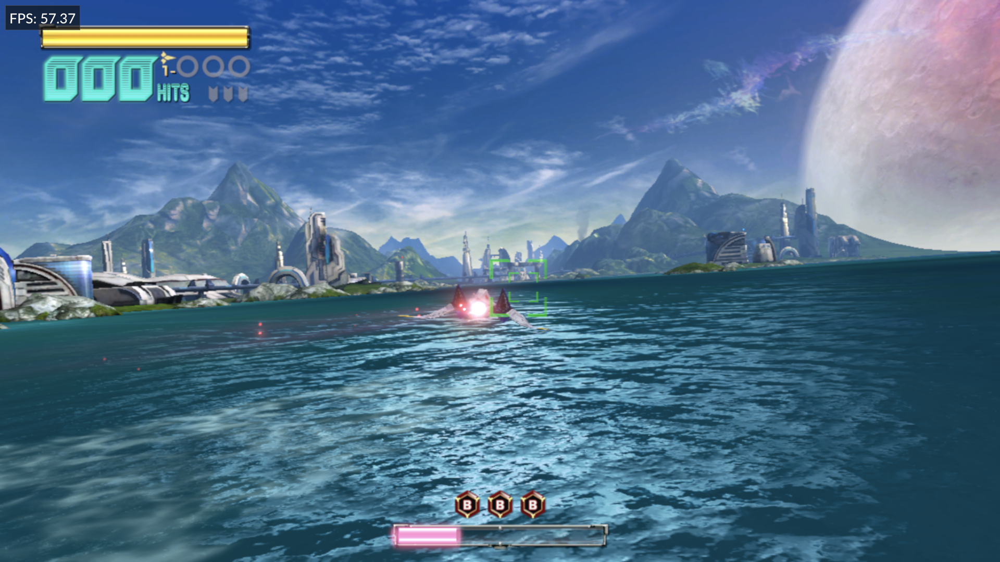
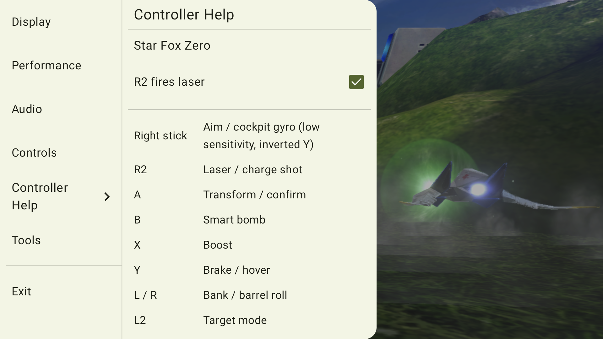

# Cemu for AYN Thor Experiment



This is a personal Android experiment fork of Cemu for the AYN Thor dual-screen handheld, especially the Base/Pro/Max models built around Snapdragon 8 Gen 2 and Adreno 740.

It is vibe coded with AI assistance. It is messy, practical, and focused on making one real device do cool things. There is no guarantee of stability, correctness, compatibility, performance, or support. If that is a problem, please use upstream Cemu, another Android fork, or fork this repo and do your own thing.

Please do not open issues here. This is not a support queue. Fork it, patch it, break it, fix it.

## Screenshots





## Credit

This project stands on other people's work:

- [Cemu](https://github.com/cemu-project/Cemu), the original Wii U emulator project.
- [SSimco/Cemu](https://github.com/SSimco/Cemu), Android fork work this branch tracks and merges from.
- [SapphireRhodonite/Cemu](https://github.com/SapphireRhodonite/Cemu), especially the Android dual-screen direction that made this AYN Thor experiment a useful starting point.

The current personal fork is [noeldvictor/Cemu-thor-experiment](https://github.com/noeldvictor/Cemu-thor-experiment).

## What This Fork Is

- A Cemu Android build branded as **Cemu for AYN Thor Experiment**.
- A personal-use AYN Thor branch, not a general Android compatibility promise.
- A dual-screen handheld playground with Android presentation-display support.
- A test bed for Star Fox Zero on Thor, including controller profile work, graphics-pack cheats, and crash/performance experiments.
- An opt-in custom Turnip Vulkan driver flow for people testing community Turnip builds.

Thor Base, Pro, and Max are treated as the same performance class: Snapdragon 8 Gen 2 CPU and Adreno 740 GPU. The Pro/Max RAM and storage are useful for multitasking, shader/cache headroom, and huge libraries, but they should not need different emulator CPU/GPU code paths from Base. The Lite model is the outlier and is not the main target of this fork.

This project does not include games, keys, firmware dumps, system files, or copyrighted game assets.

## Clear Divergence From Cemu Android

This fork has intentionally diverged from a plain Cemu Android build in several places:

- Separate Android package id: `info.cemu.cemu_thor`.
- AYN Thor dual-screen behavior for PAD presentation, screen swapping, and external-screen rotation.
- Two-panel in-game OSD with Display, Performance, Audio, Controls, Controller Help, and Tools sections.
- OSD toggles for FPS display, session-only performance experiments, GamePad audio, and GamePad volume.
- Custom Turnip driver download/select flow for Android Vulkan driver testing.
- Star Fox Zero USA game profile with Thor-specific performance defaults.
- Snapdragon/Adreno performance experiments: Android performance hints, fixed 60 Hz surface hints, PAD render-scale control, reduced dual-screen present serialization, and less global locking in hot HLE atomics.
- Star Fox Zero controller profile that keeps physical right stick for gyro-style aiming and moves boost/brake/maneuvers to buttons.
- Star Fox Zero OSD Controller Help, including an `R2 fires laser` live toggle.
- Built-in Star Fox Zero cheat graphic packs for Infinite Life and Super Shot.
- Android ARM64 recompiler and crash fixes found while testing Star Fox Zero on Thor.
- Experimental branding, icon, screenshots, and docs that make this fork visibly separate from upstream Cemu.

## Star Fox Zero Notes

The Star Fox profile is opinionated because the AYN Thor is not a Wii U GamePad. The current Thor layout is:

- Right stick: gyro-style cockpit aim
- R2: laser / charge shot
- A: transform / confirm
- B: smart bomb
- X/Y: boost / brake by emulating Wii U right-stick up/down
- L/R: bank / barrel roll by emulating Wii U right-stick left/right
- L2: target view
- Select: recenter aim
- L3/R3: U-turn / somersault

The OSD toggle can swap A and R2 for people who prefer the other laser/transform layout.

## Building

Android lives in `src/android`.

From the repo root:

```sh
git remote set-url origin git@github.com:noeldvictor/Cemu-thor-experiment.git
git submodule update --init --recursive
```

From `src/android`:

```sh
./gradlew.bat :app:assembleRelease
```

Release builds are the only useful builds for performance testing. Debug builds can be much slower.

The release APK installs as `info.cemu.cemu_thor`. The debug APK installs separately as `info.cemu.cemu_thor.debug`, but debug builds are mostly for UI/dev smoke tests, not FPS testing.

## License

Cemu is licensed under the [Mozilla Public License 2.0](LICENSE.txt). Dependency and source-file exceptions follow the upstream license notes.

This fork's branding/docs/screenshots are part of the experiment. The emulator code remains under the applicable upstream licenses.
